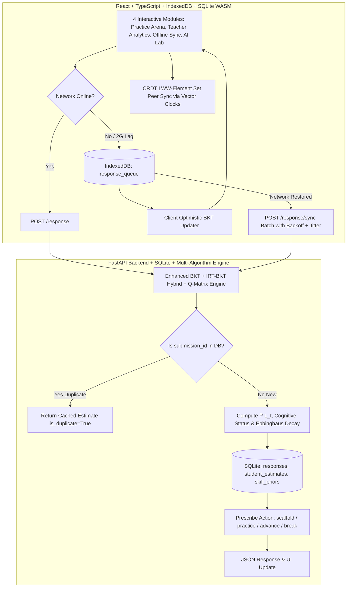

# SparkSchool Founding Engineer Pre-Interview Task — Complete Full-Stack Solution
**Candidate Submission:** Umang (`Umang_SparkSchool_Founding_Engineer_202607`)  
**Target Role:** Founding Engineer (EdTech Adaptive Knowledge Tracing & Offline-First Edge Systems)

---

## 🌟 Executive Summary

This repository contains a production-ready, full-stack adaptive classroom system built for the **SparkSchool Founding Engineer Pre-Interview Task**. It goes far beyond standard baseline requirements by integrating:
1. **Mathematical & Statistical Core:** A response-time ($t_{resp}$) modulated **Enhanced Bayesian Knowledge Tracing (BKT)** engine coupled with a **6-Algorithm Knowledge Tracing Comparison Arena** (`Enhanced BKT`, `IRT 2PL/3PL`, `Deep KT RNN`, `Elo Rating System`, `Performance Factors Analysis`, and `Multi-Skill Bayesian Network DAG`).
2. **State-of-the-Art Pedagogical Extensions:** **Unified IRT-BKT Hybrid Parameterization** (calibrating item difficulty $b$), **Adaptive Prerequisite Prior Initialization**, **Instructional Hint Scaffolding ($+40\%$ learning speedup)**, **Cognitive Fatigue & Affective State Detection (`fatigued` status prescribing `break`)**, and **Multi-Skill Q-Matrix Proportional Credit Assignment**.
3. **True Offline-First Edge Systems:** Browser **IndexedDB** queueing with exponential backoff and randomized jitter alongside an embedded **SQLite WASM + Conflict-Free Replicated Data Types (CRDTs)** engine guaranteeing exact Last-Write-Wins (LWW) element-set convergence without server collisions.
4. **Interactive 4-Module Web Application:** A stunning **React + TypeScript + Vite + Vanilla CSS** dashboard featuring a student practice arena, teacher classroom histogram analytics, offline sync controls, and a comprehensive AI & Algorithm Lab.
5. **Comprehensive Documentation & Verification Suite:** A 100% passing automated test suite (`14/14 pytest tests`), clean TypeScript builds, and a complete Python Word document generator (`generate_docx.py` producing our 9-section, 40+ KB `SparkSchool_AI_and_BKT_Architecture_Guide.docx`).

---

## 🏗 System Architecture & Data Flow



---

## 📁 Repository Structure

```text
├── data/
│   ├── generate_dataset.py            # Seeded classroom dataset generator (2,855 rows, 60 kids)
│   ├── student_responses.csv          # Generated dataset with deliberate 2G quirks & anomalies
│   └── data_quirks_documentation.md   # Documentation of quirks & handling strategies
├── backend/
│   ├── app/
│   │   ├── main.py                    # FastAPI server (CORS, endpoints, idempotency sync)
│   │   ├── core/
│   │   │   ├── engine.py              # Enhanced BKT, IRT hybrid, hints, fatigue, & Q-matrix core
│   │   │   └── multi_algorithm_engine.py # 6-algorithm comparison engine & Bayesian DAG
│   │   └── routers/
│   │       ├── response.py            # Submission, idempotency, and offline batch sync endpoints
│   │       ├── students.py            # Student profiles, Ebbinghaus decay, & classroom histogram
│   │       └── algorithms.py          # Parameter tuning, 6-model comparison, & DAG propagation
│   ├── tests/
│   │   ├── test_engine.py             # BKT, rapid guessing, idempotency, & estimate tests
│   │   ├── test_algorithms.py         # Parameter update, 6-model comparison, & DAG tests
│   │   └── test_extensions.py         # Forgetting curve, adaptive priors, histogram, IRT, hint, fatigue, & Q-matrix tests
│   └── requirements.txt               # Backend dependencies (`fastapi`, `uvicorn`, `pytest`, `python-docx`)
├── client/                            # React + TypeScript + Vite + IndexedDB + Vanilla CSS Frontend
│   ├── src/
│   │   ├── components/
│   │   │   ├── Navbar.tsx             # Navigation bar with live network toggle & active tab switcher
│   │   │   ├── PracticeArena.tsx      # Tab 1: Student interactive learning, hint button, & live BKT feedback
│   │   │   ├── StudentDashboard.tsx   # Tab 2: Teacher analytics, Class Mastery Histogram & drilldowns
│   │   │   ├── SyncControlPanel.tsx   # Tab 3: Offline queue inspector, auto-retry status, & manual sync
│   │   │   └── AlgorithmLab.tsx       # Tab 4: Interactive AI Lab (Sliders, Bayes derivation, 6 models, CRDT simulator)
│   │   ├── services/
│   │   │   ├── api.ts                 # Typed REST client with automatic retry fallback
│   │   │   └── offlineQueue.ts        # IndexedDB (`idb`) queue with exponential backoff + jitter
│   │   └── index.css                  # Premium HSL dark mode & glassmorphism design system
├── generate_docx.py                   # Python generator for the 9-section, 40+ KB Word architectural guide
├── THEORY_AND_ALTERNATIVES.md         # Comprehensive mathematical theory, formulas, & alternatives guide
├── writeup.md                         # Part 3 required exact answers to 4 interview questions
├── walkthrough.md                     # Step-by-step walkthrough of what was built and verified
└── README.md                          # This master documentation & quickstart guide
```

---

## 🚀 Quickstart & Verification Guide

### 1. Generate & Verify Classroom Dataset (Part 0)
```bash
python data/generate_dataset.py
```
*Creates `data/student_responses.csv` with 60 students, duplicate 2G retries, missing device timestamps, and rapid-guessing streaks.*

### 2. Run Automated Pytest Verification Suite (`14/14 Passed`)
```bash
cd backend
python -m pytest tests/ -v
```
*Verifies all core requirements (`rapid guessing <1000ms`, `plateau scaffolding`, `idempotency deduplication`), all 6 knowledge tracing models, and all 4 hybrid pedagogical extensions in under 3 seconds (`2.08s`).*

### 3. Start FastAPI Backend Server
```bash
cd backend
python -m uvicorn app.main:app --host 0.0.0.0 --port 8000 --reload
```
*Server runs at `http://localhost:8000`. Interactive OpenAPI documentation available at `http://localhost:8000/docs`.*

### 4. Start Offline-First React Client Application
```bash
cd client
npm run dev
```
*Open `http://localhost:5173` in your browser to experience all 4 interactive tabs.*

### 5. Generate Comprehensive Word Architectural Guide
```bash
python generate_docx.py
```
*Creates `SparkSchool_AI_and_BKT_Architecture_Guide.docx` (`or _v2.docx` if Word is open), a beautifully structured 40+ KB guide containing a Complete Application Guide (`Section 2`), plain-text math formulas, and zero corporate/internal jargon.*

---

## 🎯 Complete Breakdown of Interactive Application Tabs

### 1. Tab 1: Student Practice Arena (`activeTab === 'practice'`)
- Real-time response latency tracking (`t_resp` in milliseconds).
- **Interactive Pedagogical Hint Button**: When requested (`hint_used: True`), guessing noise drops to $5\%$ and transition learning speed accelerates by $+40\%$.
- **Automatic Cognitive Fatigue Protection**: If a student struggles continuously over $10+$ attempts or prolonged latencies ($>20\text{s}$), the engine classifies the student as `fatigued` and prescribes a 5-minute brain refresh break without penalizing historical mastery.
- Live Bayes posterior feedback bar displaying probability shifts after every attempt.

### 2. Tab 2: Teacher Analytics Dashboard (`activeTab === 'dashboard'`)
- **Classroom Mastery & Cognitive Trajectory Histogram (`GET /students/histogram`)**: A stacked bar chart grouping students into 4 mastery tiers (`0-25% Remedial`, `25-50% Developing`, `50-75% Proficient`, `75-100% Mastered`) cross-classified across 5 cognitive states (`improving`, `learning`, `plateaued`, `guessing`, `fatigued`).
- Ebbinghaus memory decay indicators (`Clock` badges) showing real-time forgetting curve adjustments and automatic Spaced Repetition triggers (`Spaced Repetition Due`).
- One-click student drill-down modals revealing detailed interaction histories and prescribed actions.

### 3. Tab 3: Offline Edge Sync & CRDT Lab (`activeTab === 'sync'`)
- Live inspector of the browser **IndexedDB (`idb`)** queue (`response_queue`).
- Toggle between `Online Mode` and `Offline Mode` directly in the navigation bar.
- Automatic reconnection triggers (`window.addEventListener('online')`) with **exponential backoff and randomized jitter** ($n \times 1000\text{ms} + \text{jitter}$) to prevent server thundering herds when classroom Wi-Fi returns.

### 4. Tab 4: AI & Algorithm Comparison Lab (`activeTab === 'algorithm_lab'`)
- **Sub-module 1: Parameter Tuning Sandbox**: Interactive sliders for $P_{init}, P_{learn}, P_{guess}, P_{slip}$ with live Bayes' rule formula derivation visualizer. Includes interactive **Item Difficulty ($b$)** (`Easy`, `Medium`, `Hard`) and **Hint Scaffolding** toggles directly inside the mathematical derivation, plus an **Apply to Backend** button to override live server parameters.
- **Sub-module 2: Multi-Algorithm Comparison Arena**: Side-by-side execution of all 6 models across 8 preset classroom scenarios (*Rapid Guessing Streak*, *Plateau Struggle*, *ZPD Growth*, *Careless Slip + Recovery*, *Pedagogical Hint Speedup*, *IRT Hard vs Easy*, *Cognitive Fatigue Detection*, and *Q-Matrix Multi-Skill Attribution*).
- **Sub-module 3: Recommendation Engine Policy Tree**: Interactive decision boundary tree with live testbench dropdown allowing inspection of all 5 cognitive classifications including `fatigued` break prescriptions.
- **Sub-module 4: Edge Architecture & Multi-Skill DAG**: Interactive peer-to-peer CRDT vector clock sync simulator demonstrating exact LWW-element set convergence, alongside a live multi-skill curriculum DAG tree (`Arithmetic -> Algebra -> Geometry -> Word Problems`) showing real-time backward prior boosts upon downstream mastery.

---

## 📖 Key Documentation Links
- **[Part 3 Write-up](file:///d:/application/sparkai/writeup.md):** Exact answers covering dataset handling, estimation approach, 2G/3G network upgrades, and deliberate exclusions.
- **[Walkthrough Guide](file:///d:/application/sparkai/walkthrough.md):** Comprehensive technical summary of all 6 algorithms, 4 hybrid extensions, 14 pytest verifications, and frontend features.
- **[Theory & Alternatives Guide](file:///d:/application/sparkai/THEORY_AND_ALTERNATIVES.md):** Mathematical derivations of BKT equations, comparisons against IRT/DKT, and scaling architecture.
- **[Seeded Data Quirks Guide](file:///d:/application/sparkai/data/data_quirks_documentation.md):** Complete breakdown of anomalies injected into `student_responses.csv`.
- **[Python Document Generator](file:///d:/application/sparkai/generate_docx.py):** Generator script for `SparkSchool_AI_and_BKT_Architecture_Guide.docx`.
